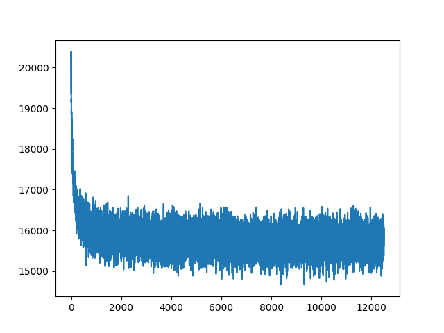
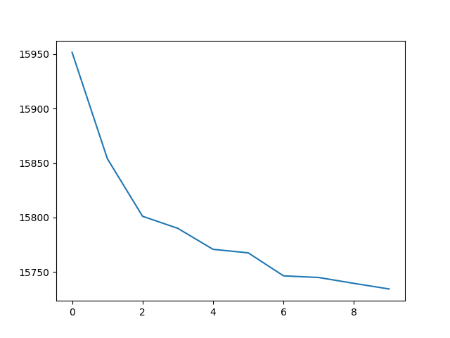
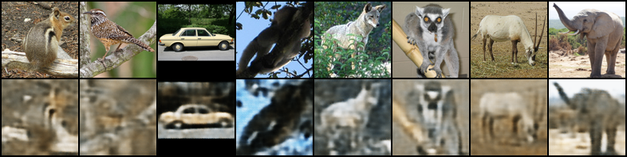

# Variational Autoencoder with InceptionV3 architecture

Implementation of a number of VAEs with various architectures in PyTorch:

- `vae.py` - 'Vanilla' VAE with full-connected encoder / decoder layers only 
- `vae_conv.py` - VAE with two ConvNets for encoder / decoder 
- `vae_inception.py` - VAE with [InceptionV3](https://arxiv.org/abs/1512.00567) modules adapted for feature extraction

The networks are adapted for the [STL10 dataset](http://ai.stanford.edu/~acoates/stl10/) and trained on the unlabeled fold in self-supervised 
fashion in order to learn useful representations. Downstream tasks can be performed by freezing the
weights of the net and extending the last layer with a full-connected `# hidden -> # output classes`
layer along with a softmax.

## Training

The training is done via the `train.py` script and an `ArgumentParser` for hyper-parameter specification. A number of scripts can be used if training on a HPC 
cluster such as NYU Prince, specifically:
- `sbatch scripts/submit.sh`
    - on a [SLURM cluster](https://slurm.schedmd.com/documentation.html) will run the training job and email
the results (stdout) to the user notifying of the completion
- `sh scripts/hpc.sh`
    - will push the local code and training scripts to the compute cluster
- `sh scripts/results.sh` 
    - will download the reconstructions and some training / test loss data via `scp`
    - can then use `plot_from_csv()` from `utils/general` to generate an image plot of 
    the training or test loss

If not training on a compute cluster (assuming `python3` and `virtulenv` is installed), 
```
$ python3 -m venv env
$ source env/bin/activate
$ pip3 install -r requirements.txt
$ python3 train.py
```

### Training Notifications

Since training VAEs for a sufficient number of epochs may take a while, can use [knockknock](https://github.com/huggingface/knockknock) for getting notifications via either email or via a Slack workspace. To configure, can add a `.env` file with a `SLACK_WEBHOOK_URL` environment variable that points to the incoming webhook URL for an application added to a Slack workspace.

## Models
| Name            | File                      | # parameters      |
| --------------- |:--------------------------| -----------------:|
| VAE             | `models/vae.py`           |         7,406,856 |
| ConvNet VAE     | `models/vae_conv.py`      |         4,257,725 |
| InceptionV3 VAE | `models/vae_inception.py` |        62,160,233 |

## Results

Training Loss (BCE + KL divergence)       |  Test Loss (BCE + KL divergence)
:-------------------------:|:-------------------------:
   |  

Reconstruction             |  
:-------------------------:|
   |